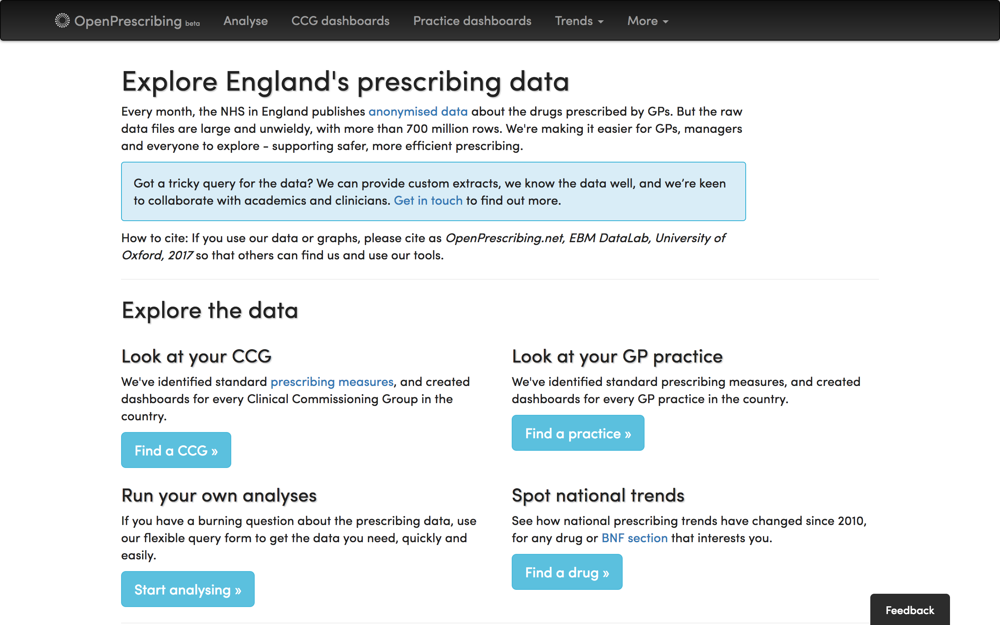

# openprescribingR

OpenprescribingR is a small package I made to allow you to import OpenPrescribing data directly into RStudio.

It uses the (beta) RESTful API from OpenPrescribing.

You could still download it onto your desktop directly from the API, but I think that doing this in-studio makes it much easier to update the information.

The package is split into the look-up and the data import functions.
('Information API' and 'Spending API')

Installation:

`library(devtools)`

`devtools::install_github("fergustaylor/openprescribingR")`

Load:

`library(openprescribingR)`

__These functions give details on drugs/organisations/list sizes.__

 *  drug_details()

 *  organisation_codes()
 
 *  list_size()

__These functions allow you to load data.__

 *  spending_by_CCG()

 *  spending_by_code()

 *  spending_by_practice()

CCG Boundraries are unavailable for now

Further explanation on the terms used here - [https://openprescribing.net/api/](https://openprescribing.net/api/)

Essential reading on [https://openprescribing.net/api/](https://openprescribing.net/caution/)

