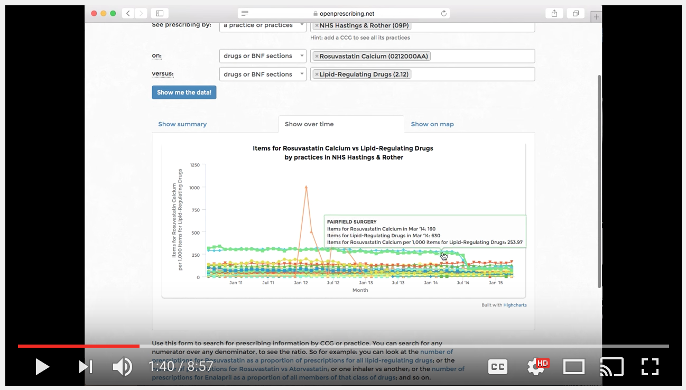

# OpenprescribingR

OpenprescribingR is a small package I made to import OpenPrescribing.net data directly into RStudio.

It uses the (beta) RESTful API from OpenPrescribing.

You could still download it onto your desktop directly from the API, but if you're going to be doing analysis with R, I think that doing this in-studio makes it much easier and more reproduceable.

The package is split into the look-up and the data import functions.

Installation:

`library(devtools)`

`devtools::install_github("fergustaylor/openprescribingR")`

Load:

`library(openprescribingR)`

__These functions give details on drugs/organisations/list sizes.__

 *  drug_details()

 *  organisation_codes()
 
 *  list_size()
 
 *  CCG_boundaries_or_location()

__These functions allow you to load spending data.__

 *  spending_by_CCG()

 *  spending_by_code()

 *  spending_by_practice()

Update 13/08/16: CCG boundary/practice location function was added. Returns GeoJSON.

An introduction to the tool is given here - [https://fergustaylor.github.io/blog/post4](https://fergustaylor.github.io/blog/post4)

And the new CCG boundary/practice location function - [https://fergustaylor.github.io/blog/post5](https://fergustaylor.github.io/blog/post5)

Further explanation on the terms used here - [https://openprescribing.net/api/](https://openprescribing.net/api/)

Essential reading on [https://openprescribing.net/caution/](https://openprescribing.net/caution/)

A guide to using OpenPrescribing.net by Ben Goldacre. (Links to youtube).

